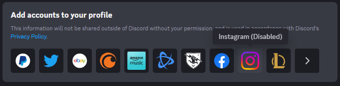

# AllConnectionsEnabled
Enables all connections (except for the Amazon Music you have to enable that via experiments)

## Installation

1. Clone Vencord and do the usual stuffs if you have not already. [Vencord Dev Docs](https://docs.vencord.dev)
    - https://docs.vencord.dev/installing/
    - https://docs.vencord.dev/installing/custom-plugins/
2. Open a terminal and change your current directory to the userplugins folder (and create it if you have not already), then type `git clone https://github.com/coopeeo/vc-allConnectionsEnabled allConnectionsEnabled`
3. Installed!
